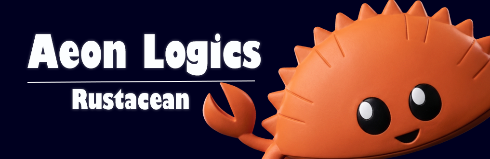

# Aeon Logics

<div align="center">
  
</div>

<br />

<table>
  <tr>
    <td width="120px" valign="top" align="center">
      <code><b>æ</b></code>
    </td>
    <td valign="top">
      <h1>Aeon Logics <a href="https://github.com/trending?l=rust"></a></h1>
      <p><i>Engineers of high-performance full-stack applications, custom desktop native experiences, microservices, and specialized databases.</i></p>
      <p>
        <code>⚡ Frontend & Backend</code> &nbsp; 
        <code>⚡ Desktop Systems</code> &nbsp; 
        <code>⚡ Distributed Servers</code>
      </p>
    </td>
  </tr>
</table>

---

### 🛠️ Production Web Applications

<table width="100%">
  <tr>
    <!-- GlassDB Card -->
    <td width="50%" valign="top" style="border: 1px solid #1a1d24; border-radius: 12px; padding: 20px; background: #0f1115;">
      <h3>GlassDB 🟢</h3>
      <p>An ultra-efficient, highly scalable database system natively designed inside the Rust storage layer environment to deliver robust, lightning-fast transaction executions.[cite: 2]</p>
      <br />
      <code>Rust</code> <code>ACID KV Store</code> <code>Distributed Servers</code> <code>Railway</code>
      <br /><br />
      <a href="https://railway.app"><b>Launch Live App ↗</b></a>
    </td>
    <!-- HisabKitabPro Card -->
    <td width="50%" valign="top" style="border: 1px solid #1a1d24; border-radius: 12px; padding: 20px; background: #0f1115;">
      <h3>HisabKitabPro 🟢</h3>
      <p>A standalone enterprise inventory ledger and data utility designed to manage high-frequency record indexing under strict performance budgets.[cite: 2]</p>
      <br />
      <code>Rust</code> <code>Inventory Engine</code> <code>Systems Logic</code> <code>Production App</code>
      <br /><br />
      <a href="https://hisabkitab.pro"><b>Launch Live App ↗</b></a>
    </td>
  </tr>
</table>

---

### 💻 System & Operational Environment

* **Host Platform:** Local multi-core computing engine (16GB RAM / Dedicated Graphics Hardware)
* **Operating System:** Linux (Arch Architecture, Custom Window Management Layouts)[cite: 1]
* **Workspace Frameworks:** Zed Editor (Vim Engine Keybindings) // RustRover IDE[cite: 1]
* **Telemetry Core:** `aeon-fetch` — A custom-compiled native utility rendering real-time host architecture configurations and memory usage directly to the shell terminal.[cite: 1]

```rust
// Environment Blueprint
fn main() -> Result<(), SystemFault> {
    let mut runtime = SharpSystem::init()?;
    runtime.mount_storage("GlassDB")?;
    
    println!("Aeon Logics // Stack fully initialized.");
    Ok(())
}
